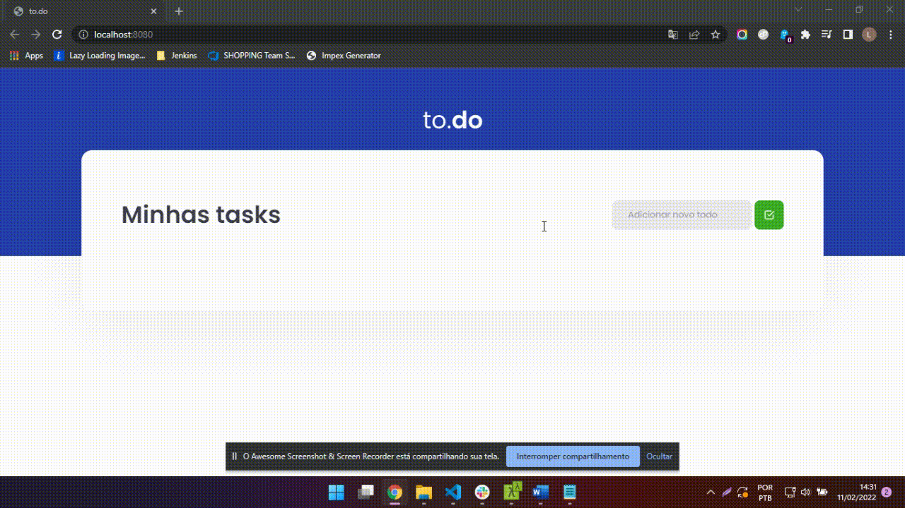

## TODO List

In this module, we create a base structure of a React application, using tools such as Webpack, Babel, Webpack Dev Server, etc. The application is a TODO list, with insert, mark complete and delete task.

To run the application, just clone the repository and run the command 'yarn' and then 'yarn dev', opening the project on the port 'http://localhost:8080/'

Ignite Journey - Rocketseat

